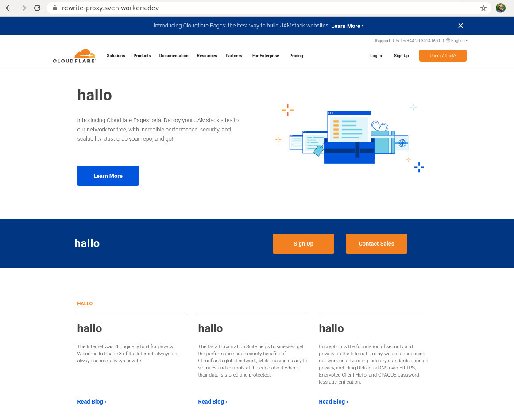

# Rewrite proxy

## Usage

```
curl -H 'x-host: www.cloudflare.com' https://rewrite-proxy.sven.workers.dev/
```



## Usage in WPT

Use the following script:

```
overrideHost    *cloudflare.com rewrite-proxy.sven.workers.dev
navigate        https://www.cloudflare.com
```

## Wrangler

You can use [wrangler](https://github.com/cloudflare/wrangler) to generate a new Cloudflare Workers project based on this template by running the following command from your terminal:

```
wrangler generate myapp https://github.com/xtuc/worker-template-rewrite-proxy
```

Before publishing your code you need to edit `wrangler.toml` file and add your Cloudflare `account_id` - more information about publishing your code can be found [in the documentation](https://workers.cloudflare.com/docs/quickstart/configuring-and-publishing/).

Once you are ready, you can publish your code by running the following command:

```
wrangler publish
```

## Serverless

To deploy using serverless add a [`serverless.yml`](https://serverless.com/framework/docs/providers/cloudflare/) file.
